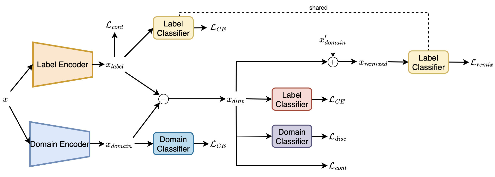

# ADRMX: Additive Disentanglement of Domain Features with Remix Loss

This is an official implementation of [ADRMX: Additive Disentanglement of Domain Features with Remix Loss](https://arxiv.org/abs/2303.06439). In this repository, we provide the codes for required DomainBed extensions to reproduce our results. 



## Preparing Environment

1. Clone the DomainBed repository: [DomainBed](https://github.com/facebookresearch/DomainBed.git)
2. Download the datasets and adjust the paths
3. Clone this repository to update the files `algorithms.py`, `hparams_registry.py` and add `utils.py` under domainbed directory


## Getting Started
1. **Conda (Recommended)**: 
    ```shell
    conda create -n ADRMX
    conda activate ADRMX
    ```

2. **Pip**
    ```shell
    pip install -r requirements.txt
    ```

3. **Example Training Command**: 
    ```shell
    cd PROJECT_PATH 
    python -m domainbed.scripts.train --data_dir=./domainbed/data/ --algorithm ADRMX --dataset PACS
    ```

<!---
```BibTeX
@article{demirel2023decompl,
  title={DECOMPL: Decompositional Learning with Attention Pooling for Group Activity Recognition from a Single Volleyball Image},
  author={Demirel, Berker and Ozkan, Huseyin},
  journal={arXiv preprint arXiv:2303.06439},
  year={2023}
}
```
-->
